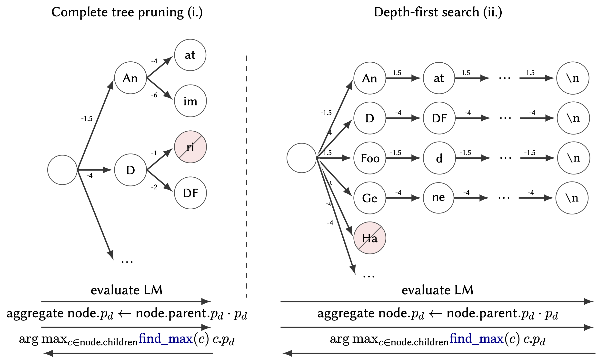

# Beam Search over Efficient `llama.cpp` generations

## Install

```sh
pip install llama-cpp-beam-search
pip install git+https://github.com/Dakantz/llama-cpp-python.git@main
# OR
uv add  llama-cpp-beam-search
uv pip install git+https://github.com/Dakantz/llama-cpp-python.git@main
```


### Multi-Platform Compatibility

You can prepend the variable to trigger the `llama-cpp-python` build for your specific platform/accelerator ([see here](https://llama-cpp-python.readthedocs.io/en/latest/install/macos/)).
```sh
# MacOS + PIP
CMAKE_ARGS="-DGGML_METAL=on" pip install git+https://github.com/Dakantz/llama-cpp-python.git@main
# MacOS + UV
CMAKE_ARGS="-DGGML_METAL=on" uv pip install git+https://github.com/Dakantz/llama-cpp-python.git@main
# CUDA + PIP
CMAKE_ARGS="-DGGML_CUDA=on" pip install git+https://github.com/Dakantz/llama-cpp-python.git@main
# CUDA + UV
CMAKE_ARGS="-DGGML_CUDA=on" uv pip install git+https://github.com/Dakantz/llama-cpp-python.git@main
```

## Theory

Our rough idea was to get a complete (holistic) probabilistic view of the tokens and prune accordingly. To save on the search space, we only take $f$ expansions, or go depth first.



## Example Usage

```python
from llama_cpp_beamsearch.completion import BeamSearchCompletion
from llama_cpp_beamsearch.config import BeamSearchConfig
from llama_cpp import Llama, LlamaGrammar, ChatCompletionRequestMessage
import re
model = Llama.from_pretrained(
    repo_id="unsloth/Qwen3-0.6B-GGUF",
    filename="*Q4_0.gguf",
    verbose=False,
    logits_all=True,
)
allowed_tokens = ["Wrench", "Screwdriver", "Ornament"]
allowed_tokens_str = " | ".join(f'"{t}"' for t in allowed_tokens)
grammar = LlamaGrammar(
    _grammar=f"""
    root ::= allowed_tokens
    start ::= ( allowed_tokens " "  )*
    allowed_tokens ::= {allowed_tokens_str}
    """
)
config = BeamSearchConfig(
    max_depth=1,
    end_token=None,
    k_progress=[2, 3],
)
completion = BeamSearchCompletion(model, grammar, config)

message = "Hello?"

result = completion.completion_beam_search(message, max_tokens=5)
assert re.match(r"^((Wrench|Screwdriver|Ornament) ?)*$", result)
```